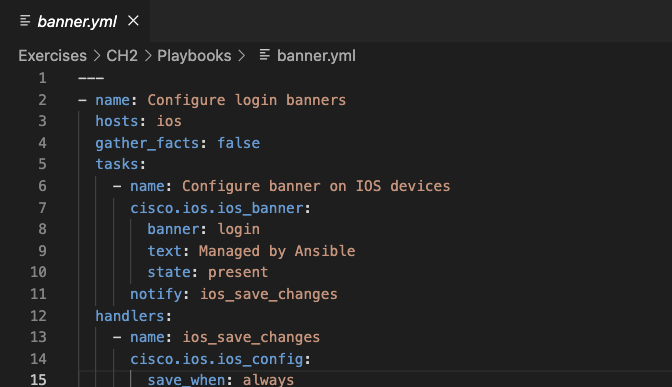

.Current Course Guide Example
[source,bash]
----
---
- name: Configure login banners
  hosts: ios
  gather_facts: false
  tasks:
    - name: Configure banner on IOS devices
      cisco.ios.ios_banner:
        banner: login
        text: Managed by Ansible
        state: present
      notify: ios_save_changes
  handlers:
    - name: ios_save_changes
      cisco.ios.ios_config:
        save_when: always
----

.Example with Vertical Bars
[source,bash]
----
---
- name: Configure login banners
  hosts: ios
  gather_facts: false
  tasks:
  ¦ - name: Configure banner on IOS devices
  ¦ ¦ cisco.ios.ios_banner:
  ¦ ¦ ¦ banner: login
  ¦ ¦ ¦ text: Managed by Ansible
  ¦ ¦ ¦ state: present
  ¦ ¦ notify: ios_save_changes
  handlers:
  ¦ - name: ios_save_changes
  ¦ ¦ cisco.ios.ios_config:
  ¦ ¦ ¦ save_when: always
----
